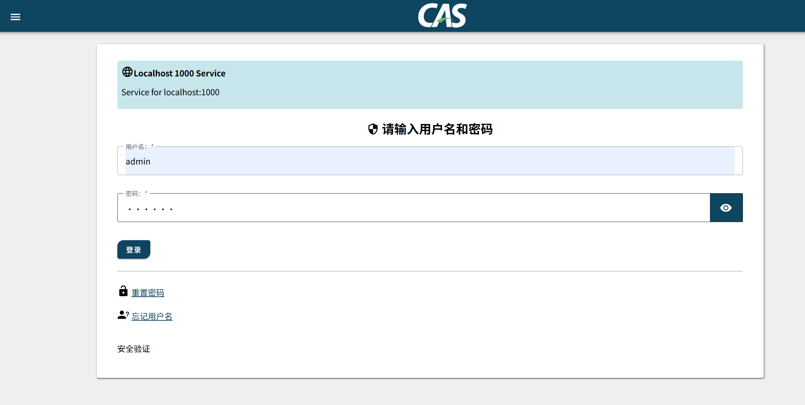
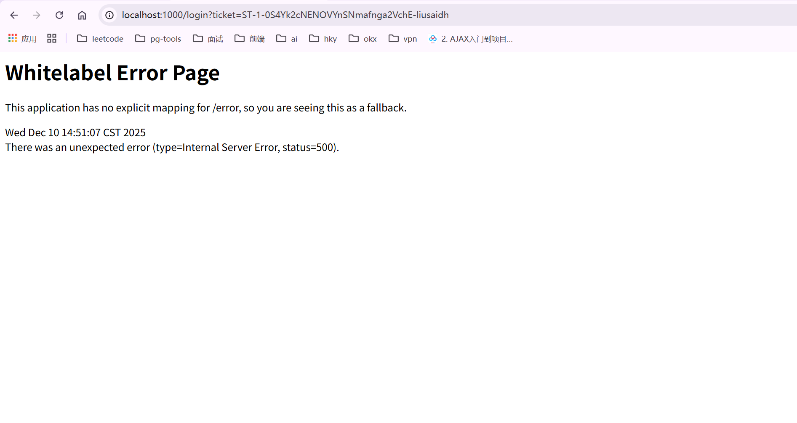
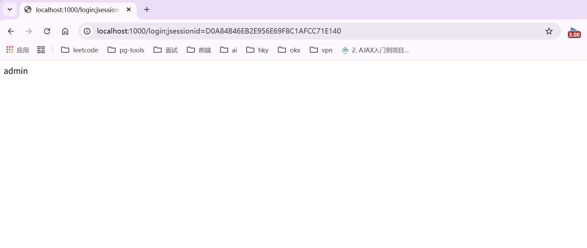

# 📘 CAS 7.0 服务端快速搭建使用说明（中文）

## 🍎环境与前置要求
- 基于cas-overlay-template项目搭建（https://github.com/apereo/cas-overlay-template）
- CAS 版本：7.0
- JDK：21
- 使用项目自带的 Gradle Wrapper（无需单独安装 Gradle）：在 Windows 运行 `gradlew.bat`
- 简单的数据库脚本 user.sql
- 将gradlew.properties和application.yml中的目录改为自己的想要的目录

## 🍋密钥生成与配置
- 生成密钥：
```powershell
.\gradlew.bat createKeystore
```
- 如需修改密钥文件生成位置，在 `gradle.properties` 中调整相关配置
- 在 `application.yml` 中配置密钥使用地址

## 🍌数据库配置
- 在 `./src/main/resources/application.yml` 中修改数据库连接与查询密码配置

## 🍇页面与国际化
- 修改页面上显示的信息或返回的错误信息：编辑 `./src/main/resources/messages_zh_CN.properties`
- 项目使用 Spring Boot / CAS 的国际化（i18n）机制

## 🍑注册 CAS 客户端
- 在 `./etc/cas/services` 目录下创建服务定义文件，开放对应的 CAS 客户端
- eg：开发localhost的1000端口，访问`http://localhost:1000/login`，重定向到`http://localhost:8080/cas/login?service=https://localhost:1000/login`

## 🍉客户端证书信任（CRT）
- 找到第一步生成的 `cas.crt`
- 在包含该文件的目录下执行证书导入命令（指定jdk21的目录为自己的目录）：
```powershell
keytool -importcert -file cas.crt -keystore "D:\\develop\\Java21\\lib\\security\\cacerts" -alias "cas-server"
```
- 默认密钥库密码：`changeit`
- 未导入证书时，重定向到services时客户端访问示例会失败：`http://localhost:1000/login?ticket=ST-4-Ni-zzjc8HpB6S5QcwHHRJmcvGoQ-liusaidh`

添加后可以正常访问：

- 出现jessionid问题时，需要在客户端的application.yml中添加配置：
```yaml
server:
  port: 8000
  servlet:
    session:
      cookie:
        # 解决登录重定向出现的 url 带jessionId问题
        secure: false
        http-only: true
      tracking-modes: cookie
```
- 删除已导入的证书：
```powershell
keytool -delete -alias cas-server -keystore "D:\\develop\\Java21\\lib\\security\\cacerts"
```
## 🥭运行 CAS 服务端
- 启动 CAS 服务端：
```powershell
.\gradlew.bat run
```
- 默认 CAS 服务端地址：`https://localhost:8080/cas`
- 输入数据库登录用户名密码
## 🍹待续
- linux部署
- 重置密码
- 忘记用户名